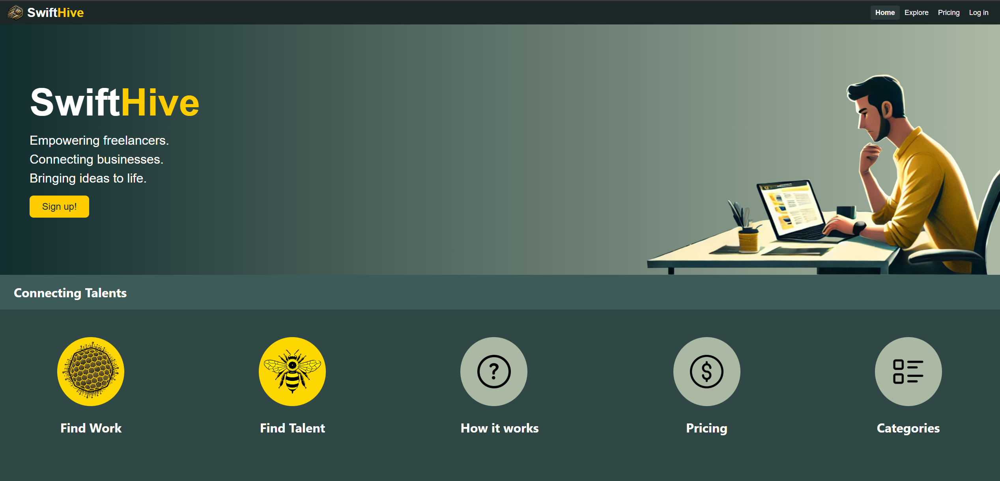
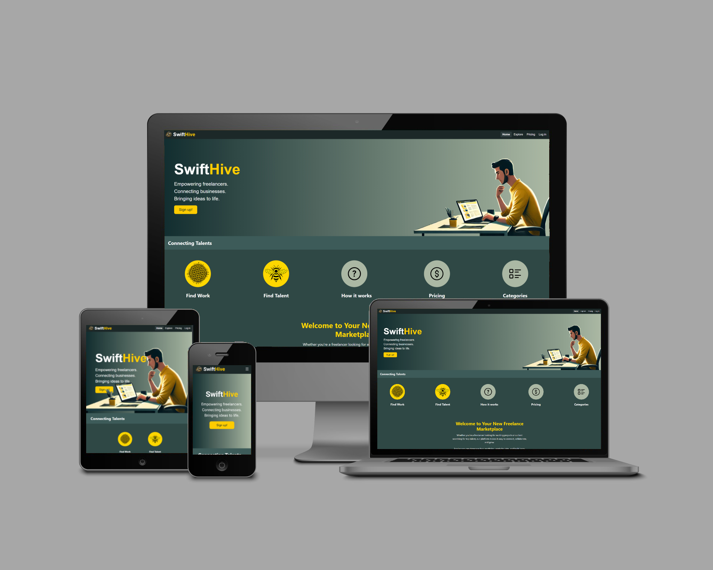
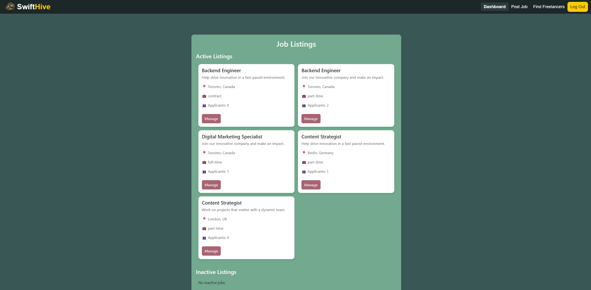
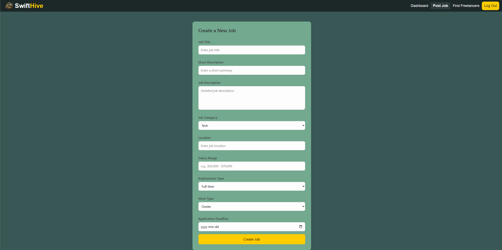
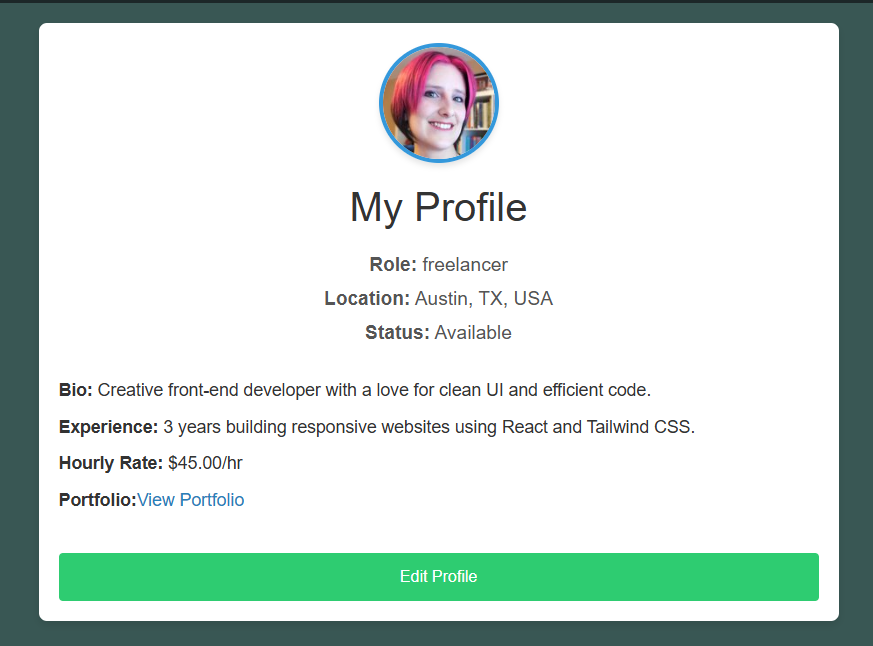
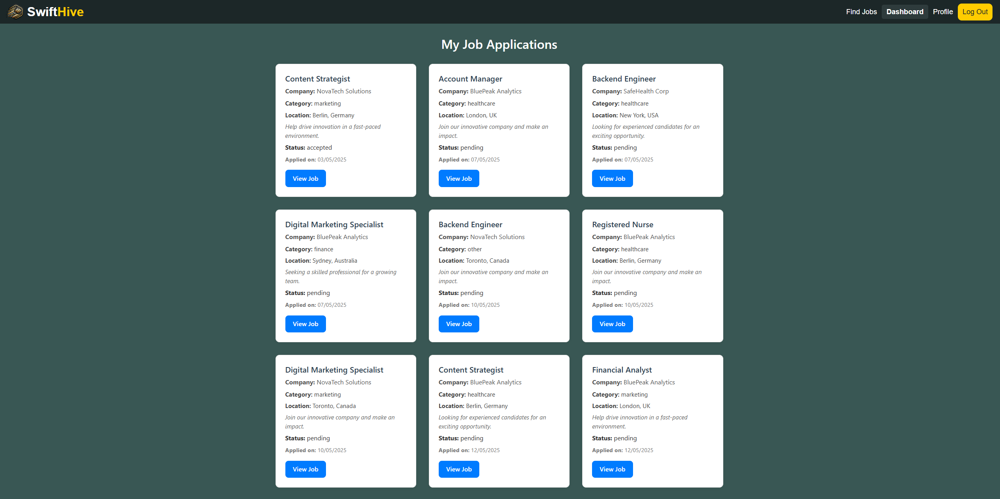
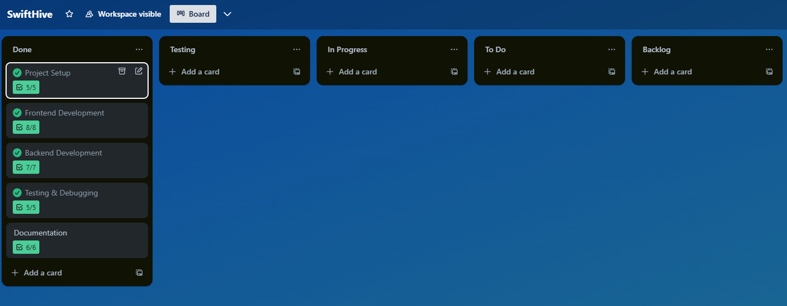

# 🌐 Swifthive – Find & Hire Freelancers

Swifthive is a full-stack web platform that allows users to register as **freelancers** or **clients**, enabling job listings, applications, profile creation and view job application status. It aims to streamline the freelancing process with an intuitive UI and secure back-end.

---

## 📁 Table of Contents

* [Project Overview](#project-overview)
* [Live Demo](#live-demo)
* [User Types & Key Features](#user-types--key-features)
* [UX & Design](#ux--design)
* [Tech Stack](#tech-stack)
* [Data Models](#data-models)
* [User Stories](#user-stories)
* [Component Structure](#component-structure)
* [Installation](#installation)
* [Deployment](#deployment)
* [Testing](#testing)
* [Agile Workflow](#agile-workflow)
* [Security](#security)
* [Credits](#credits)

---

## 📌 Project Overview

Swifthive connects freelancers and clients in a modern marketplace for remote work. Built with React and Django REST Framework, users can create profiles, post jobs, apply to gigs, and manage hiring—all within one platform.






---

## 🌍 Live Demo

[Swifthive](https://swifthive-8bbba3ed51bd.herokuapp.com/)

---

## 👥 User Types & Key Features

### 🎯 Clients

* Register and create job postings
* Browse freelancer profiles
* View applications and hire candidates




### 👷 Freelancers

* Register and build a profile
* Browse job listings
* Apply for jobs with a custom pitch





---

## 🎨 UX & Design

Designed for clarity, ease-of-use, and responsiveness. Color-coded statuses and clear CTAs guide users through hiring or applying.

---

## 🧰 Tech Stack

### Front-End

* React + React Router
* Axios for API requests
* Context API / useState for state management
* Tailwind / Bootstrap for styling

### Back-end
[Backend Project](https://github.com/Vretinger/swifthive-api)

---

## 💡 User Stories

| Role       | Story                                                                |
| ---------- | -------------------------------------------------------------------- |
| Client     | As a client, I want to post a job so that freelancers can apply      |
| Freelancer | As a freelancer, I want to create a profile to showcase my skills    |
| Freelancer | As a freelancer, I want to apply to jobs with a custom message       |
| Client     | As a client, I want to view applicants and select the best candidate |

---

## 🧱 Component Structure

React components are structured modularly for maintainability:

* `Navbar.js` – Site-wide navigation
* `ExploreJobs.js` – Renders available jobs
* `CreateJob.js` – Job creation/edit form
* `FreelancerDetails.js` – Shows freelancer details
* `ClientDashboard.js` – Client home screen
* `freelancerDashboard.js` – freelancer home screen

---

## 💻 Installation

### Clone the Repo

```bash
git clone https://github.com/yourusername/swifthive.git
cd swifthive
npm install
```

### Back-End Setup

```bash
cd backend
pip install -r requirements.txt
python manage.py migrate
```

---

## 🚀 Deployment

* Front-End deployed via Heroku
* Back-End deployed via Heroku
* Environment variables secured in `.env`

---

## 🥮 Testing
[Testing documentation](Testing.md)

---

## 🗓️ Agile Workflow

Agile methodology was followed using Trello:

* User stories tracked in sprints
* Regular commits with clear messages


## [Trello board](https://trello.com/invite/b/68263523210377e9a501d2f0/ATTIbdb2c7d303997cb0887d74444e8647097DC5BFD5/swifthive)



---

## 🔒 Security

* JWT Authentication
* CSRF protection
* `.env` variables excluded from version control

---

## 🙏 Credits

* Icons from [Font Awesome](https://fontawesome.com/)
* Profile Avatars from [Random User Generator](https://randomuser.me/)
* Cloudinary for media hosting
* Django & React documentation
